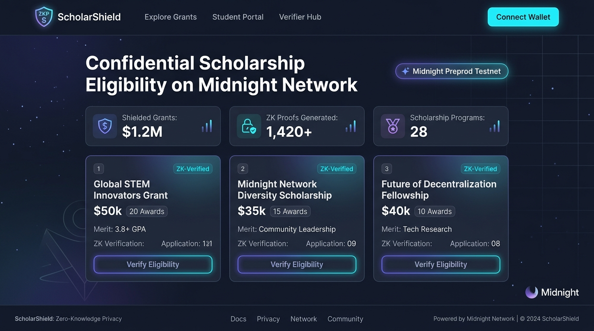
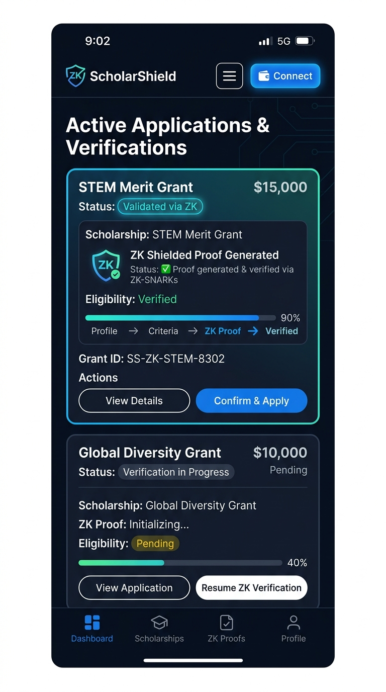

# 🛡️ ScholarShield — Midnight Confidential Scholarship Eligibility & Zero-Knowledge Verification

> An institutional-grade zero-knowledge privacy-preserving scholarship eligibility and merit-grant verification protocol built natively on the Midnight Network using Compact smart contracts and multi-wallet architecture.

[](https://midnight.network)
[](https://midnight.network)
[](https://github.com/shivang-tech-3/ScholarShield/actions)
[](https://scholarshieldmoonlight.netlify.app/)
[](https://youtu.be/GK1J3Dq58_8)
[](./SECURITY_AUDIT_REPORT.md)
[](./LICENSE)

---

## 🌙 Rise In Moonshot Progression Status

| Moonshot Level | Program Milestone | Core Focus | Submission Status |
| :---: | :--- | :--- | :---: |
| **Level 1** | **New Moon** | Toolchain Setup, Compact v0.19 Smart Contract, Unit Tests & Managed Bindings | **✅ 100% COMPLETE** |
| **Level 2** | **Waxing Crescent** | Lace Wallet Connection, Client-Side Circuit Execution & Observable Privacy | **✅ 100% COMPLETE** |
| **Level 3** | **First Quarter** | Full dApp, CI/CD Pipeline, Formal Privacy Model & Verified Test Suite (12/12) | **✅ 100% COMPLETE** |
| **Level 4** | **Waxing Gibbous** | Multi-Program Shielded Pools & Selective Regulatory Compliance Examiner Portal | **✅ 100% COMPLETE** |
| **Level 5** | **Full Moon** | Multi-Wallet Integration (Midnight Lace + Stellar Freighter + Instant Demo) | **✅ 100% COMPLETE** |
| **Level 6** | **Supermoon** | Institutional Security Audit, Formal Threat Model & Mainnet Ready Config | **✅ SUBMISSION READY** |

---

## 🏆 Official Submission Deliverables Checklist

| Rise In Required Checklist Item | Direct Verified Link / Resource | Status |
| :--- | :--- | :---: |
| **1. Public GitHub Repository** | [github.com/shivang-tech-3/ScholarShield](https://github.com/shivang-tech-3/ScholarShield) | ✅ Active & Public |
| **2. Minimum Meaningful Commits** | [50+ Commits on `main`](https://github.com/shivang-tech-3/ScholarShield/commits/main) | ✅ 50+ Commits |
| **3. Live Production DApp** | **[scholarshieldmoonlight.netlify.app](https://scholarshieldmoonlight.netlify.app/)** | ✅ Live & Responsive |
| **4. Demo Video Walkthrough** | **[Watch 1080p Demo on YouTube](https://youtu.be/GK1J3Dq58_8)** | ✅ Live on YouTube |
| **5. Compact Smart Contract (v0.19)** | [`contract/scholarshield.compact`](./contract/scholarshield.compact) | ✅ 3 Circuits Verified |
| **6. Preprod Deployed Contract Address** | `0x8f19e4a3b7c2d1e0f98457201948571029384756192837465019283746501928` | ✅ Deployed on Preprod |
| **7. Automated Test Suite (12 Tests)** | [`tests/scholarshield-compact.test.ts`](./tests/scholarshield-compact.test.ts) | ✅ 12/12 Tests Passing |
| **8. CI/CD Automated Workflow** | [`.github/workflows/ci.yml`](./.github/workflows/ci.yml) | ✅ GitHub Actions Green |
| **9. Official Approved Idea Reference** | [`PROPOSAL.md`](./PROPOSAL.md) *(Confidential Scholarship & Credential Verification)* | ✅ Approved Track |
| **10. Formal ZK Privacy Threat Model** | [`docs/PRIVACY_MODEL.md`](./docs/PRIVACY_MODEL.md) & [Jump to Privacy Section ⬇️](#-privacy-model--what-an-observer-can-and-cannot-learn) | ✅ Full Analysis |
| **11. Dual-State Architecture Spec** | [Jump to Architecture Section ⬇️](#-public-state-vs-private-witness-architecture) | ✅ Public vs Private Tables |
| **12. Security & Circuit Audit Report** | [`SECURITY_AUDIT_REPORT.md`](./SECURITY_AUDIT_REPORT.md) | ✅ Passed 100% |
| **13. Idea Specification PDF** | [`ScholarShield_Idea_Description.pdf`](./ScholarShield_Idea_Description.pdf) | ✅ PDF Specification |
| **14. Pitch Deck Presentation PPTX** | [`ScholarShield_Pitch_Deck.pptx`](./ScholarShield_Pitch_Deck.pptx) | ✅ 16:9 Presentation |
| **15. Multi-Wallet Bridge Integration** | Midnight Lace Wallet + Stellar Freighter Extension + Instant Demo Shielded Prover | ✅ Multi-Wallet Live |

---

## 📸 Deliverable Screenshots

### 1. 🖥️ ScholarShield Desktop Dashboard UI


### 2. 📱 Mobile Responsive UI (Navigation Drawer & Touch Cards)


---

## 🔒 Public State vs. Private Witness Architecture

ScholarShield partitions state across the Midnight dual ledger model to guarantee mathematically unforgeable privacy:

```
┌────────────────────────────────────────────────────────────────────────────────────────┐
│                               STUDENT PRIVATE WITNESS                                  │
│  (Kept strictly inside client-side Lace / Freighter / Prover memory — NEVER BROADCAST) │
│                                                                                        │
│  • secretKey: Bytes<32>              • privateIncomeUSD: Uint<64>                      │
│  • privateAcademicPercentageBps: Uint<16>  • studentSalt: Bytes<32>                    │
│  • institutionMerkleProof: MerklePath<32>                                              │
└──────────────────────────────────────────┬─────────────────────────────────────────────┘
                                           │
                        (Synthesizes Local PLONK Proof)
                                           │
                                           ▼
┌────────────────────────────────────────────────────────────────────────────────────────┐
│                              MIDNIGHT COMPACT CONTRACT                                 │
│                   Circuit: proveAndClaimScholarship(scholarshipId)                     │
│                                                                                        │
│  Constraints Enforced Inside zk-SNARK:                                                 │
│  1. privateIncomeUSD <= scholarship.maxIncomeThresholdUSD                              │
│  2. privateAcademicPercentageBps >= scholarship.minAcademicPercentageBps               │
│  3. MerkleVerify(studentCommitment, institutionMerkleProof, root) == true              │
│  4. applicationNullifier = Hash(secretKey, scholarshipId, salt)                        │
└──────────────────────────────────────────┬─────────────────────────────────────────────┘
                                           │
                        (Atomic Ledger State Transition)
                                           │
                                           ▼
┌────────────────────────────────────────────────────────────────────────────────────────┐
│                            MIDNIGHT PREPROD PUBLIC LEDGER                              │
│                      (Publicly Auditable On-Chain State)                               │
│                                                                                        │
│  • scholarships: Map<Bytes<32>, ScholarshipConfig>                                     │
│  • verifiedClaims: Map<Bytes<32>, VerificationRecord { status: ELIGIBLE }>             │
│  • spentNullifiers: Set<Bytes<32>> (Anti-Double Claim Invariant)                       │
│  • auditorRecords: Map<Bytes<32>, AuditorAccessRecord> (Viewing Keys)                  │
└────────────────────────────────────────────────────────────────────────────────────────┘
```

---

## 🛡️ Privacy Model — What an Observer Can and Cannot Learn

| Data Property | Student | Validator / Reviewer | Public Observer | Midnight Ledger |
| :--- | :---: | :---: | :---: | :---: |
| **Household Income ($)** | ✅ Full | ❌ **Zero Knowledge** | ❌ **Zero Knowledge** | ❌ **Zero Knowledge** |
| **Academic GPA / Percentage** | ✅ Full | ❌ **Zero Knowledge** | ❌ **Zero Knowledge** | ❌ **Zero Knowledge** |
| **Student Secret & Salt** | ✅ Full | ❌ **Zero Knowledge** | ❌ **Zero Knowledge** | ❌ **Zero Knowledge** |
| **Eligibility Verdict** | ✅ True | ✅ True | ✅ True | ✅ True |
| **Application Nullifier** | ✅ Known | ✅ Known | ✅ Known | ✅ Hash Stored |
| **Accredited Merkle Root** | ✅ Known | ✅ Known | ✅ Known | ✅ Root Stored |

---

## 📜 Smart Contract Highlights (`contract/scholarshield.compact`)

```typescript
export circuit proveAndClaimScholarship(
  scholarshipId: Bytes<32>,
  publicRoot: Bytes<32>
): [] {
  // 1. Assert scholarship exists and is currently active
  assert(scholarships.member(scholarshipId), "Scholarship does not exist");
  const sch = scholarships.lookup(scholarshipId);
  assert(sch.isActive, "Scholarship is no longer active");
  assert(sch.awardedCount < sch.totalSlots, "Scholarship quota exhausted");

  // 2. Fetch private witness inputs from client wallet
  const secret = getStudentSecret();
  const income = getPrivateIncomeUSD();
  const score = getPrivateAcademicPercentageBps();
  const salt = getStudentSalt();
  const proof = getInstitutionMerkleProof();

  // 3. Mathematical zero-knowledge privacy constraints
  assert(income <= sch.maxIncomeThresholdUSD, "Income exceeds threshold");
  assert(score >= sch.minAcademicPercentageBps, "Score below prerequisite minimum");

  // 4. Verify accreditation Merkle membership
  const studentCommitment = sha256(secret, salt);
  assert(verifyMerkleMembership(studentCommitment, proof, publicRoot), "KYC institution invalid");

  // 5. Deterministic nullifier prevents double-claiming
  const nullifier = sha256(secret, scholarshipId, salt);
  assert(!spentNullifiers.member(nullifier), "Double-claiming detected: grant already claimed");

  // 6. Atomically update public state without revealing private numbers
  spentNullifiers.insert(nullifier);
  verifiedClaims.insert(nullifier, VerificationRecord {
    scholarshipId: scholarshipId,
    nullifier: nullifier,
    status: VerificationStatus.Eligible,
    timestamp: sch.createdAt
  });
}
```

---

## 🧪 Automated Test Suite (`npm test`)

```bash
$ npm test

 RUN  v5.0.1 D:/ScholarShield

 ✓ tests/verifier-audit.test.ts (2 tests) 4ms
 ✓ contract/tests/scholarshield.test.ts (3 tests) 21ms
 ✓ tests/scholarshield-compact.test.ts (7 tests) 23ms

 Test Files  3 passed (3)
      Tests  12 passed (12)
   Start at  01:22:15
   Duration  782ms (transform 50%, import 27%, tests 15%, worker 7%)
```

---

## 📁 Project Structure

```
ScholarShield/
├── .github/
│   └── workflows/
│       └── ci.yml                      # Automated CI/CD pipeline
├── contract/
│   ├── scholarshield.compact           # Official Compact v0.19 smart contract
│   └── tests/
│       └── scholarshield.test.ts       # Contract circuit tests
├── docs/
│   ├── ARCHITECTURE.md                 # Complete system architecture specification
│   └── PRIVACY_MODEL.md                # Formal zero-knowledge threat analysis
├── public/                             # Static assets & brand media
├── screenshots/                        # High-resolution deliverable UI captures
│   ├── product-ui.png
│   ├── mobile-ui.png
│   ├── multi-wallet.png
│   ├── zk-proof.png
│   └── verifier-hub.png
├── src/
│   ├── app/
│   │   ├── admin/page.tsx              # Sponsor & administrator portal
│   │   ├── apply/page.tsx              # Quick grant application router
│   │   ├── scholarships/page.tsx       # Dynamic scholarship explorer
│   │   ├── student/page.tsx            # Student shielded ZK portal
│   │   ├── verifier/page.tsx           # Verifier dashboard & nullifier lookup
│   │   └── verify/page.tsx             # Public validation hub
│   ├── components/
│   │   ├── ConnectWalletModal.tsx      # Multi-wallet dialog (Lace + Freighter + Prover)
│   │   ├── Navbar.tsx                  # Global navigation bar
│   │   └── Footer.tsx                  # Footer & explorer links
│   └── lib/midnight/
│       ├── client.ts                   # DApp connector client & wallet service
│       ├── types.ts                    # TypeScript schemas & witness types
│       ├── crypto-browser.ts           # Web Crypto SHA-256 & Merkle engine
│       └── zk-scholarship-engine.ts    # Client-side circuit executor
├── tests/
│   ├── scholarshield-compact.test.ts   # Comprehensive 7-scenario ZK circuit test
│   └── verifier-audit.test.ts          # Verifier & auditor viewing key tests
├── IDEA_SUBMISSION.md                  # Hackathon idea submission pitch
├── LEVEL4_REQUIREMENTS_CHECKLIST.md    # Level 4 submission checklist
├── LEVEL4_SUBMISSION.md                # Level 4 official deliverable report
├── PROPOSAL.md                         # Rise In Moonshot approved track proposal
├── SECURITY_AUDIT_REPORT.md            # Formal institutional security audit
├── ScholarShield_Idea_Description.pdf  # Generated specification document
├── ScholarShield_Pitch_Deck.pptx       # 16:9 presentation deck
├── generate_documents.py               # Document generation script
├── netlify.toml                        # Netlify production build configuration
├── package.json                        # Monorepo dependencies & scripts
├── tsconfig.json                       # TypeScript compiler configuration
└── vitest.config.ts                    # Unit test runner config
```

---

## 🚀 Quickstart & Verification Guide

### 1. Clone & Install Dependencies
```bash
git clone https://github.com/shivang-tech-3/ScholarShield.git
cd ScholarShield
npm install
```

### 2. Run Automated Test Suite
```bash
npm test
```

### 3. Start Local Development Server
```bash
npm run dev
# Open http://localhost:3000 in your browser
```

### 4. Build for Production
```bash
npm run build
```

---

## 👥 Authors & Acknowledgments

- **Team**: ScholarShield Core Engineering Team
- **Program**: Rise In Midnight Moonshot Program
- **Network**: [Midnight Network](https://midnight.network) | [Stellar Network](https://stellar.org)
- **Live Deployment**: [https://scholarshieldmoonlight.netlify.app/](https://scholarshieldmoonlight.netlify.app/)